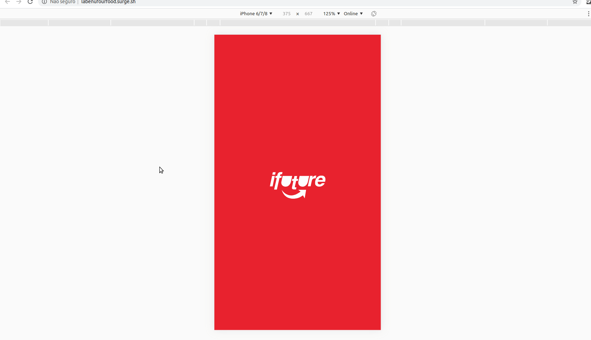

# 4food


## Descrição
Implementação de um app funcional baseado no modelo do ifood

### Link:

[deploy](http://labenufourfood.surge.sh/)

> Status do Projeto: Concluido :heavy_check_mark:

### Principais tecnologias utilizadas:

1. React
2. Redux
3. Redux-Thunk: Integração do redux com requisições assíncronas.
4. Autenticação
5. Estilização Avançada com CSS
6. Uso de bibliotecas de UI (MaterialUI)
7. Aplicações com múltiplas rotas utilizando React Router
8. Formulários com Validação

## Requisitos gerais

1. **Não é permitido push na master** (após o commit inicial com o boilerplate), todas as outras alterações devem ser feitas seguindo o fluxo de trabalho:
    1. Abre branch
    2. Ao acabar abre PR
    3. Pelo menos 1 integrante do grupo revisa o PR e aprova
2. É esperado que o projeto tenha testes unitários, com uma cobertura mínima de 60%, não é obrigatório o uso de TDD, mas estimulado 😉.
3. O projeto só tem layout mobile, então **não se preocupem com layout no desktop**, a ideia é que vocês desenvolvam e testem somente mobile. Estimulamos que vocês testem nos próprios celulares para garantir a qualidade da experiência.
    1. **Lembrem-se** de testar usando o devTools simulando celular! Ao simular um celular no devTools ele troca nosso mouse pra um "dedo" pq um **clique** é diferente de um **toque** e isso pode influenciar a experiência de uso da sua aplicação.
4. Respeitem o layout providenciado, na entrega será avaliado o quanto o projeto está seguindo as referências de tela no zeplin.
5. Vocês deverão realizar a integração com um backend que fizemos para esse projeto. A sua documentação só será disponibilizada no momento oportuno


## Como rodar a aplicação 


No terminal, clone o projeto:

```git clone: https://github.com/felipe0520/4eddit ```

Entre na pasta do projeto  :
```cd 4eddit ```

Instale as dependências : 
```npm install ```

Execute a aplicação:

```npm start ```


## Gif da aplicação funcionando em ambiente mobile:



## Contribuidores

img src="https://avatars3.githubusercontent.com/u/59846340?s=460&u=cb097d69eba8545f1d4ac03b754089500d52e9bf&v=4" width=115 > <br> <sub> 
Eloísa Faguntes</sub>https://github.com/EloisaFagundes|
| :---: |  

